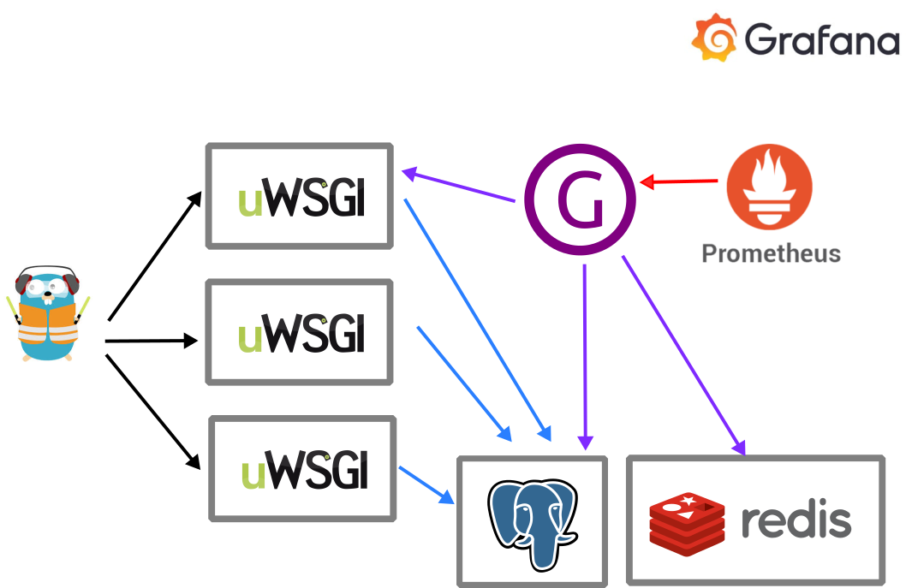

# Bleemeo Quote

This is a sample demo application that generates a quote of the day.
Code is instrumented to be used with Bleemeo to show how you can
simply observe an application.

## Architecture



## Run it

To run in development on Debian/Ubuntu system, we recommend pipx usage :
```
sudo apt install pipx
pipx ensurepath
echo "Restart your shell if you just installed pipx
pipx install poetry pre-commit
pre-commit install
```

On MacOS:
```
brew install python@3.12 pipx
pipx ensurepath
echo "Restart your shell if you just installed pipx"
pipx install poetry pre-commit
pre-commit install
poetry env use python3.12
```

To run:
```
poetry install --no-root --sync
poetry shell

python manage.py migrate
python load_initial_data.py
python manage.py runserver
```

## Upgrade packages:

```
poetry update
poetry self add poetry-plugin-export
poetry export --without-hashes --only main -f requirements.txt --output requirements.txt

pre-commit autoupdate
```

## Generates Load

There is a basic load generator script that allows you to generate
loads on the application

Just run it:
```
python generate_load --port 8000 --delay 0.2
```

You can use more advanced options (for example to specify your host
when you are using Traefik):
```
usage: generate_load.py [-h] [--hostname HOSTNAME] [--address ADDRESS]
                        [--path PATH] [--port PORT] [--delay DELAY] [--random]
                        [--verbose]

optional arguments:
  -h, --help           show this help message and exit
  --hostname HOSTNAME
  --address ADDRESS
  --path PATH
  --port PORT
  --delay DELAY
  --random
  --verbose
```

or with kubernetes:
```
kubectl -n quote scale deployment --replicas=1 quote-load-generator
```
