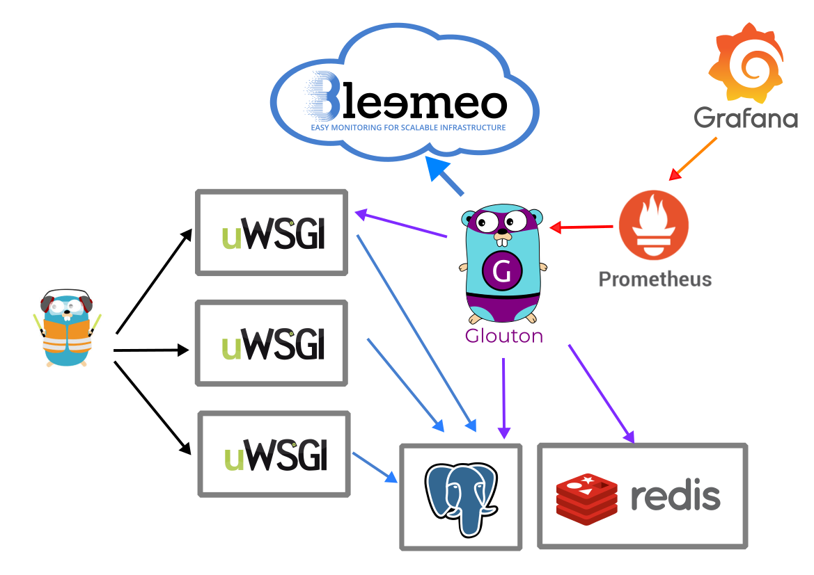

# Bleemeo Quote

This is a sample demo application that generates a quote of the day.
Code is instrumented to be used with Bleemeo to show how you can
simply observe an application.

## Architecture



## Run it

With docker, you can simply run:

```
docker-compose up -d
```

To run in development on Debian/Ubuntu system:

```
mkvirtualenv -p /usr/bin/python3 bleemeo-quote
pip install -r requirements.txt
python manage.py migrate
python load_initial_data.py
python manage.py runserver
```

Upgrade packages on MacOS:

```
deactivate
rmvirtualenv bleemeo-quote
mkvirtualenv -p /opt/homebrew/bin/python3.10 bleemeo-quote
pip install -r requirements-in.txt
pip freeze > requirements.txt
```

## Generates Load

There is a basic load generator script that allows you to generate
loads on the application

Just run it:
```
python generate_load --port 8000 --delay 0.2
```

You can use more advanced options (for example to specify your host
when you are using Traefik):
```
usage: generate_load.py [-h] [--hostname HOSTNAME] [--address ADDRESS]
                        [--path PATH] [--port PORT] [--delay DELAY] [--random]
                        [--verbose]

optional arguments:
  -h, --help           show this help message and exit
  --hostname HOSTNAME
  --address ADDRESS
  --path PATH
  --port PORT
  --delay DELAY
  --random
  --verbose
```

or with kubernetes:
```
kubectl -n quote scale deployment --replicas=1 quote-load-generator
```
